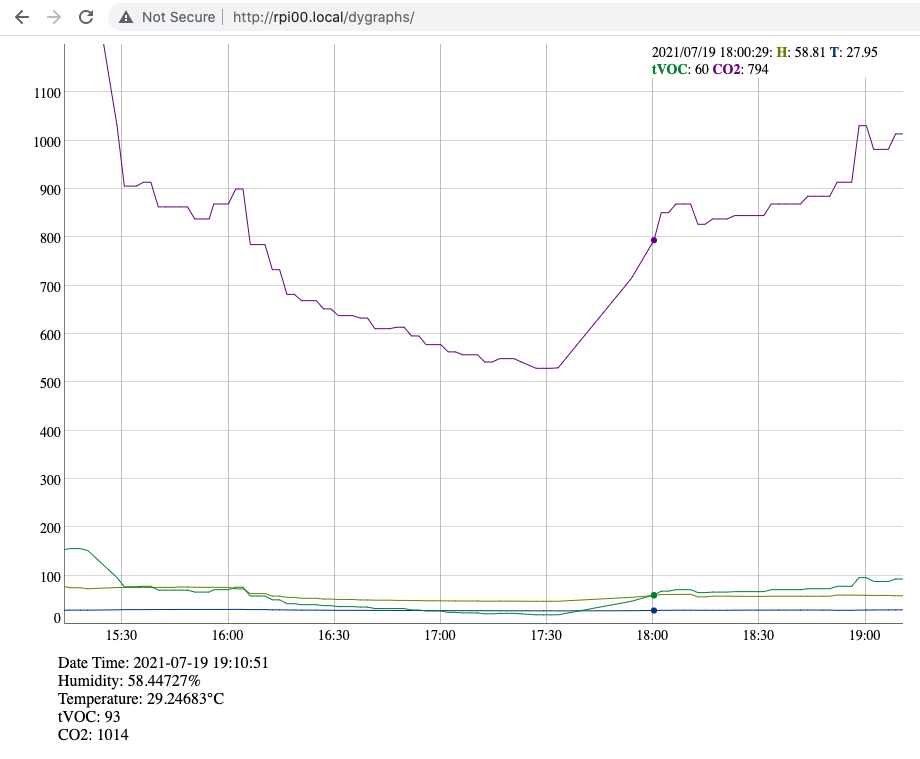
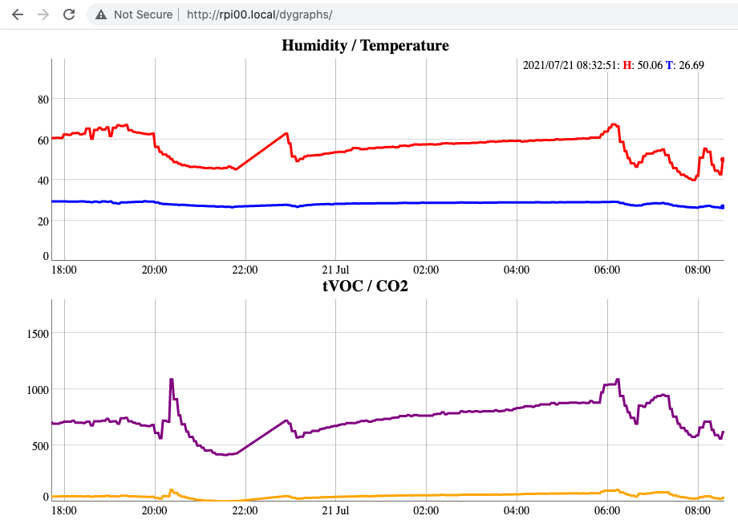

# BastWAN Listener Static Web Page

See [this blog post](https://kongduino.wordpress.com/2021/07/18/indoors-environment-monitoring-with-lora-part-4/) and [this blog post](https://kongduino.wordpress.com/2021/07/19/indoors-environment-monitoring-with-lora-part-5/)

This is the code for two versions of the same experiment – tracking indoor environment data and storing it for display on a local server – either a Mac's localhost with [this Xojo app](https://github.com/Kongduino/BastWAN-Listener-Xojo) or on a Raspberry Pi with the `dygraphs.py` script. The second version, `twoCharts`, splits the data into two more readable charts, because T/H and tVOC/CO2 have ranges that aren't really compatible.

I have the script running in the background in my crontab:

```bash
@reboot sudo /usr/bin/python3 /home/pi/dygraphs.py /dev/ttyUSB0 &
```

There were originally a couple of crashes, but I seem to have caught all the exceptions, and it has been running smoothly since. I have the static page stuff in `/var/www/html/dygraphs`

## Update 2021/07/19

Added a Python version that runs off a Raspberry Pi (or any Python enabled machine) with a WisNode-LoRa RAK811 module connected via USB.

See https://twitter.com/Kongduino/status/1417024046336643074 for the moment – it will also be document in Part 5.



## Update 2021/07/21

Added a second Python version that splits the data into two charts – we now need two data CSV files, and the code has been updated. I have also played with the options to make the charts more readable – at least to my old eyes...



